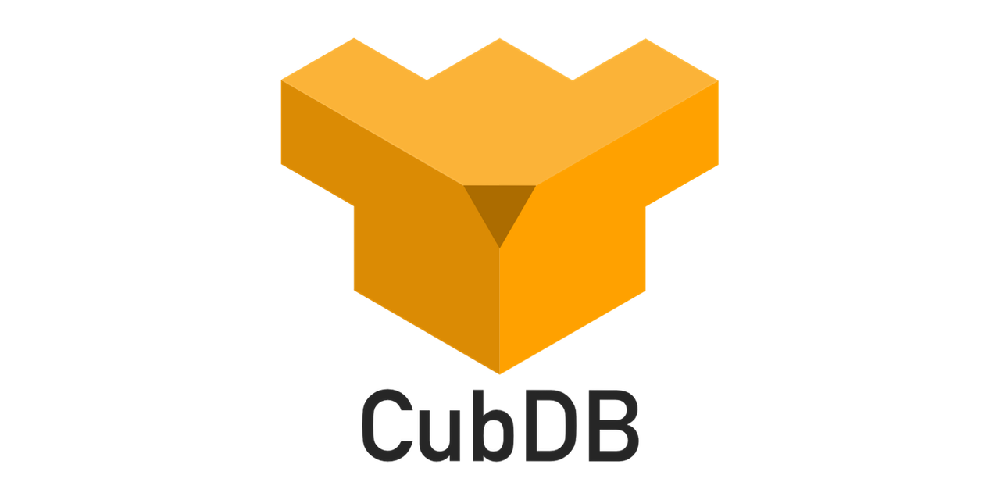

[](https://travis-ci.org/lucaong/cubdb)

<p align="center"></p>

`CubDB` is an embedded key-value database written in the Elixir language. It
runs locally, it is schema-less, and backed by a single file.

Head to the [API reference](https://hexdocs.pm/cubdb/CubDB.html) for usage details.


## Features

  - Both keys and values can be any arbitrary Elixir (or Erlang) term.

  - Simple `get`, `put`, and `delete` operations

  - Arbitrary selection and transformation of entries with `select`

  - Atomic multiple updates with `get_and_update_multi`

  - Concurrent read operations, that do not block nor are blocked by writes

  - Sudden shtdowns won't corrupt the database or break atomicity

  - Manual or automatic compaction to optimize space usage

To ensure consistency, performance, and robustness to data corruption, `CubDB`
database file uses an append-only, immutable B-tree data structure. Entries are
never changed in-place, and read operations are performend on immutable
snapshots.


## Usage

Start `CubDB` by specifying a directory for its database file (if not existing,
it will be created):

```elixir
{:ok, db} = CubDB.start_link("my/data/directory")
```

`get`, `put`, and `delete` operations work as you probably expect:

```elixir
CubDB.put(db, :foo, "some value")
#=> :ok

CubDB.get(db, :foo)
#=> "some value"

CubDB.delete(db, :foo)
#=> :ok

CubDB.get(db, :foo)
#=> nil
```

Range of keys are retrieved using `select`:

```elixir
for {key, value} <- [a: 1, b: 2, c: 3, d: 4, e: 5, f: 6, g: 7, h: 8] do
  CubDB.put(db, key, value)
end

CubDB.select(db, min_key: :b, max_key: :e)
#=> {:ok, [b: 2, c: 3, d: 4, e: 5]}
```

But `select` can do much more than that. It can apply a pipeline of operations
(`map`, `filter`, `take`, `drop` and more) to the selected entries, it can
select the entries in normal or reverse order, and it can `reduce` the result
using an arbitrary function:

```elixir
# Take the sum of the last 3 even values:
CubDB.select(db,
  # select entries in reverse order
  reverse: true,

  # apply a pipeline of operations to the entries
  pipe: [
    # map each entry discarding the key and keeping only the value
    map: fn {_key, value} -> value end,

    # filter only even integers
    filter: fn value -> is_integer(value) && Integer.is_even(value) end,

    # take the first 3 values
    take: 3
  ],

  # reduce the result to a sum
  reduce: fn n, sum -> sum + n end
)
#=> {:ok, 18}
```

For more details, read the [API documentation](https://hexdocs.pm/cubdb/CubDB.html).

## Installation

`CubDB` can be installed by adding `cubdb` to your list of dependencies in
`mix.exs`:

```elixir
def deps do
  [{:cubdb, "~> 0.6.0"}]
end
```

## Acknowledgement

The file data structure used by `CubDB` is inspired by
[CouchDB](http://couchdb.apache.org). A big thanks goes to the CouchDB
maintainers for the readable codebase and extensive documentation.
